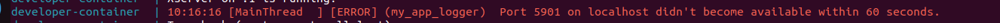

# 

## Welcome to my JdRobot Internship Blog!

Here I will write everything I learn during my internship at JdRobot.
This blog serves as a working memory, the index does not keep an alphabetical order, it only represents my ordered work from the first day of the internship. Probably problems that arise at the beginning will be solved in the following points of the table of contents. As I said, it is more a working memory or blog than an explanatory blog.

## Index

- [Welcome to my JdRobot Internship Blog!](#welcome-to-my-jdrobot-internship-blog)
- [Building GitHub Pages](#building-github-pages)
- [Launching RoboticsAcademy Docker](#launching-roboticsacademy-docker)
- [Developer Enviroment](#developer-enviroment)
- [Solving First Issue](#solving-first-issue)
- [JdRobot Division](#jdrobot-division)
- [issue-2640](#issue-2640)
- [RoboticsInfrastructure Starting Guide](#roboticsinfrastructure-starting-guide)
- [Testing exercises and solutions](#testing-exercises-and-solutions)
- [Gui interfaces and console interfaces created](#gui-interfaces-and-console-interfaces-created)
- [Opened #2655](#opened-2655)
- [Starting to solve issue #2655](#starting-to-solve-issue-2655)
- [Reopened #2576](#reopened-2576)
- [Contact](#contact)

## Building GitHub Pages

GitHub Pages is a simple way to host static websites directly from a GitHub repository. Follow these steps to set up your own GitHub Pages site:

1. **Create a Repository**:
   Go to GitHub and create a new repository. If you want your site to be available at `https://your-username.github.io`, name the repository `your-username.github.io`.

2. **Add Your Site Content**:
   Upload your index file (HTML, CSS, JavaScript). I'm using Markdown for simplicity.

3. **Configure GitHub Pages**:
   Go to the repository settings, scroll down to the "Pages" section, and select the branch you want to use for your site. If your files are in a specific folder (like `docs`), select that folder.

4. **Access Your Site**:
   After a few minutes, your site will be live at `https://your-username.github.io/repository-name` (or `https://your-username.github.io` if you named the repository after your username).

For more detailed instructions, visit the [GitHub Pages documentation](https://docs.github.com/en/pages).

## Launching RoboticsAcademy Docker

RoboticsAcademy allows you to launch the docker locally without the need for an internet connection and perform a wide variety of robotics exercises using the open-source Gazebo simulator. The user simply creates a Python program, which will interact with ROS underneath.

## Testing exercises and solutions

### Performance Metrics

First make sure you are in `RoboticsAcademy`. Run `scripts/develop_academy.sh`:
```bash
sudo sh scripts/develop_academy.sh -g
```

Exercises from RoboticsBackend 4.6.2.

#### No GPU Acceleration
SO: Ubuntu 22.04.4 LTS, RAM: 16 GB, CPU: AMD Ryzen 5 7535HS (6 cores):

| Task                     | Gazebo’s RTF | Gazebo’s FPS | % CPU Usage |
|--------------------------|--------------|-------------|------------|
| Follow Line         | 0.72         | 9           | 300%   |
| Vacuum Cleaner      | 1.0          | 18          | 450%   |
| AutoParking         | 0.88         | 5           | 380%   |
| Follow Person       | 0.99         | 18          | 500%   |
| Loc Vacuum Cleaner  | 1.0          | 18          | 450%   |
| Global Navegation   | 0.85         | 18          | 590%   |
| Rescue People       | 1.0          | 25          | 540%   |
| Obstacle Avoidance  | 0.86         | 13          | 520%   |
| 3D Reconstruction   | 0.84         | 9           | 420%   |
| Amazon Warehouse    | 0.98         | 6           | 500%   |
| Montecarlo Laser    | 1.0          | 18          | 420%    |

#### GPU Acceleration
SO: Ubuntu 22.04.4 LTS, RAM: 16 GB, CPU: AMD Ryzen 5 7535HS (6 cores), GPU: Nvidia GeForce RTX 3050 Ti:

| Task                     | Gazebo’s RTF | Gazebo’s FPS | % CPU Usage | % GPU Usage |
|--------------------------|--------------|-------------|------------|-----|
| Follow Line         | 0.97         | 58          | 110%   | 35% |
| Vacuum Cleaner      | 1.0          | 62          | 65%    | 30% |
| AutoParking         | 0.97         | 37          | 120%   | 30% |
| Follow Person       | 1.0          | 42          | 650%   | 25% |
| Loc Vacuum Cleaner  | 1.0          | 62          | 65%    | 28% |
| Global Navegation   | 1.0          | 62          | 100%   | 25% |
| Rescue People       | 1.0          | 62          | 115%   | 35% |
| Obstacle Avoidance  | 0.99         | 60          | 74%    | 23% |
| 3D Reconstruction   | 0.99         | 58          | 110%   | 30% |
| Amazon Warehouse    | 1.0          | 60          | 82%    | 25% |
| Montecarlo Laser    | 1.0          | 62          | 65%    | 35% |

### Conclusions

All the exercises work correctly, as in the previous version, except the self-localizing vacuum cleaner exercise, I have seen that the map path has changed, but even modifying it, it does not work correctly (I finally realized that the getMap() function has some problems). I have also checked that they work importing the modules in any of these ways:

Last version:
```bash
from GUI import GUI
from HAL import HAL
```

New version:
```bash
import GUI
import HAL
```

## Developer Enviroment

First of all, we have to install all the requierements. You have detailed information here: [Instructions for developers](https://github.com/JdeRobot/RoboticsAcademy/blob/humble-devel/docs/InstructionsForDevelopers.md)

### Starting Problems

I have encountered several errors when launching the script that creates the developer environment.

So I had to reinstall nvm this way:
```bash
nvm use 16
nvm install-latest-npm
```

And then reinstall yarn:
```bash
npm uninstall -g yarn
npm install -g yarn
```

### How to launch developer enviroment

```bash
cd <dir>/RoboticsAcademy
```
First we must launch the frontend like this:
```bash
curl -o- https://raw.githubusercontent.com/nvm-sh/nvm/v0.39.7/install.sh | bash
nvm install 16
nvm use 16
cd react_frontend/ && yarn install && yarn run dev
```

Finally we launch the script (in other terminal):
```bash
sudo sh scripts/develop_academy.sh
```


Using `Ctrl+c` will stop them.

## Solving first issue

Once we have the frontend launched and the script running, we can make changes and see them in real time.

The exercises proposed by JdeRoboticsAcademy feature two main classes, GUI and HAL, both of which are essential for the functioning of all exercises. HAL is based on the robot's hardware, its sensory functions. GUI allows us to modify frontend elements (maps, images), and to receive resource information from it.

When I was testing my exercises made in Service Robotics there was one that did not work correctly because a function was giving problems. For this reason, my goal has been to test modifying and trying to fix this function.

#### getMap()

Honestly, I didn't find the reason for the error in the function, it simply imported a library that for some reason didn't work and returned an empty image. I simply used another library and instead of returning the image with 4 channels, I returned it in RGB with some debugging elements:

```python
# humble-devel branch
def getMap(self, url):        
   return plt.imread(url)
```

```python
# my branch
from PIL import Image

def getMap(self, url):
   try:
   # Open with PIL
      with Image.open(url) as img:
            img = img.convert("RGB")
            img_array = np.array(img)
      return img_array
   except Exception as e:
      print(f"Error reading image from {url}: {e}")
      return None
```


#### showNumpy()

After checking that the image was loaded correctly I got another error from the showNumpy() function.

The problem at first seemed straightforward to me as it simply appeared that a list called `shared_image` was not declared.

```python
# humble-devel branch
def showNumpy(self, image):
   self.shared_image.add(self.process_colors(image))
```

```python
# my branch
from shared.image import SharedImage

def __init__(self, host):
   # Code....
   self.shared_image = SharedImage("guiimage")

# Code....

def showNumpy(self, image):
   self.shared_image.add(self.process_colors(image))
```

At this point the bug was apparently fixed, the problem came with the error in the following function.

#### process_colors()
The problem here was not so simple, besides, it was my mistake not to read the documentation on how it worked. Once I understood how it works (in my opinion it can be changed for simplicity, but all the people who have used it as it is implemented would stop working for them).

Here the error message:
`IndexError: boolean index did not match indexed array along dimension 2; dimension is 3 but corresponding boolean dimension is 1`

It took me quite a while to realise what was going on, until I debugged the size of the arrays and mask used.

The original comparation:
```python
# humble-devel branch
mask = image < 128
colored_image[mask] = image[mask][:, None] * 2
```

```python
# my branch
#### NOT USED ----- EXPLAINED ABOVE -----
def process_colors(self, image):
   if image.ndim != 3 or image.shape[2] != 1:
      print(f"The input image must be a 3D array with a single layer (height, width, 1).")
      return None

   # Grayscale image without last dim
   grayscale_image = image[:, :, 0]

   # Color exit image
   colored_image = np.zeros((grayscale_image.shape[0], grayscale_image.shape[1], 3), dtype=np.uint8)

   # Color lookup table
   color_table = {
      128: red,
      129: orange,
      130: yellow,
      131: green,
      132: blue,
      133: indigo,
      134: violet
   }

   # Grayscale for values < 128
   gray_mask = grayscale_image < 128
   colored_image[gray_mask] = grayscale_image[gray_mask][:, None] * 2

   for value, color in color_table.items():
      color_mask = (grayscale_image == value)
      colored_image[color_mask] = color

   return colored_image
```

The problem was in the comparison between an image with 3 channels and a greyscale image with only 1 channel, I solved it by adding a new matrix.

### New Problems

Once I was able to solve all the bugs, I got the code to run without any problems (my code does not work correctly as the speed controller was tested in ROS1). But the pre-navigation part should still work correctly, which I couldn't check as the map was not being updated. At first I thought I had done something wrong and showNumpy() was still having problems. So I decided to take a look at the ROS1 gui.py class and compare them. This is when I realised that the part that updates and publishes the images is still not implemented. Which is something that is out of my knowledge for now.

### Change of format

We must modify our array to a format that json understands.

### New window

To show the new map created by the user we must create a new window next to the original map, which will be updated when the user calls the showNumpy() function. The problem is that for now I don't know how to create the new window and I can't update the already created window either.

### Actualization

A few days later, thanks to a collaborator, we were able to copy the functionality of displaying the new ros1 window and fix the functions I mentioned above. The process colours function was correct, it didn't work for me because during my work with that practice the function was different.

By simply fixing the getmap() function and adding the new window, we fixed the exercise. (issue-2637)

## JdRobot Division

### Robots Academy

Repository with the exercises and frontend, here are the classes and the specific functions of each exercise.

### RoboticsApplicationManager

Repository for communications between `browser` - `manager` - `user`.

### RoboticsInfrastructure

Repository with robot models, gazebo maps and launchers. It also contains libraries such as HAL.

## issue-2640

GUI was divided into two classes, which was not efficient as this could actually be simplified. We simplified the functions and created a single global class called ThreadingGUI. Once this was done, we realised that acks are never checked. We also solved the problem.

## RoboticsInfrastructure Starting Guide

For our changes to this package to take effect in our docker we must bind the changes, they will be uploaded to the docker ws from where we will use a terminal to compile it.

### GUI as library 

We have been trying to further simplify the GUI class and create a library for its main functions. To do this, the HAL library has been used as a template. Once created (thanks to another contributor) to test the changes we must follow these steps:


First we must enter RoboticsAcademy/compose_cfg and modify the dev_humble.yaml we are using, adding these lines:

```yaml
- type: bind
        source: /home/duro/Escritorio/PRACTICAS/RoboticsInfrastructure/gui_interfaces
        target: /home/ws/src/gui_interfaces
```

Then, we will have to launch the docker, enter an exercise and from the terminal:

```bash
cd /home/ws
colcon build --symlink-install
```

Once this is done, the changes will be saved and we should be ready to test the changes.


Right now we don't know why, but it doesn't work as we want, here is an example of how the GUI.py file of one of the simplest exercises (basic vacuum cleaner) would look like:

```python
from console import start_console
from gui_interfaces.general.threading_gui import  ThreadingGUI

host = "ws://127.0.0.1:2303"
gui = ThreadingGUI(host)

# Redirect the console
start_console()
```

## Gui interfaces and console interfaces created
The problem we were having is that we had to generate an image in order to test the new 'libraries', when trying to compile from the console inside docker, they were not linking correctly.

Here is an example of the vacuum cleaner GUI.py, to see the difference from when it didn't work:

```python
import json

from gui_interfaces.general.threading_gui import ThreadingGUI
from console_interfaces.general.console import start_console
from map import Map
from HAL import getPose3d

class GUI(ThreadingGUI):

    def __init__(self, host="ws://127.0.0.1:2303"):
        super().__init__(host)

        # Payload vars
        # Specific variables....
        #
        #

        self.start()

    # Prepares and sends a map to the websocket server
    def update_gui(self):
        # Specific function for each exercise
        # Mainly sends info to update gui
        #
        #

    def reset_gui(self):
        self.map.reset()

host = "ws://127.0.0.1:2303"
gui = GUI(host)

# Redirect the console
start_console()
```

All exercises were modified, simplified and all repetitive code was removed, honestly, it is now much clearer and each exercise only has its own specific code. The rescue_people and follow_person exercises were the least simplified because of their greater complexity compared to the others.

Thanks to this breakthrough and some changes provided by other contributors, the new version 4.6.2 has been released.

## Opened #2655

The console do not works properly because it always return an incorrect line error. It looks simple, but this bug is complex.

## Updated docs

Some of the instructions were very brief and more explanations have been added to solve some of the most common problems. There is still work to be done here, but some things are still beyond my knowledge at the moment.

## Starting to solve issue #2655

### Arised Problems

The error is caused by entering 4 header lines when correcting the file, so there is always an error margin of 4 lines.
- 1 Creating a mini radi with RoboticsApplicationManager custom branch.
- 2 Creating a mini radi with the corrections made.

After several tests, I have found that for some reason the margin of error is sometimes 6 lines instead of 4.

I have also reopened an issue that occurred when quickly relaunching docker, which generates an error because port 5900 0 5901 is not cleared.

# 

To solve the error I have found two temporal solutions, the first is to remove the docker that has not been closed properly, this closes the port forcibly:

```bash
docker ps -a
```
```bash
docker rm [docker_id]
```
\
Another option is to relaunch it but with other options, that is to say, alternate between launching it with and without graphic acceleration, I suppose that in this case another port is opened and gives the previous one time to close.

```bash
sh scripts/develop_academy.sh -g
```
\
To find a solution we are checking what is keeping the ports busy, using commands such as:


```bash
lsof -i :5901
```
```bash
sudo netstat -anp | find :5901
```
\
The connection timeout in this line of `vnc_server.py` has also been increased.

```python
def wait_for_port(self, host, port, timeout=60):
```
\
But it's still not working.

Other way to solve this issue, is killing the process from inside the docker with this command:
```bash
fuser -k 5901/tcp 
```


### Solving the original issue
The process is being much slower than expected, because of all the problems that are arising, I am also not able to find the point where the errors are returned, as they are not always printed by the docker console, usually the errors are printed in the terminal where you launch the docker. If you add to this that there is not always a 4 line error, and for each test you have to relaunch the docker... 

After a lot of debugging work, I realised that the import errors originate inside the manager.py. The problem is that the manager creates a subprocess to launch the program, which truncates the standard and error outputs to appear on the console, the problem here is that we should take that output before appearing on the console and modify it.

The solution I was trying was to redirect that output to modify it by hand and put the corresponding line number, what is the problem? if it is an error outside the loop the error is 4 lines and inside or below the loop the error is 6 lines, this is due to how the lines are added to control the iteration frequency. After trying several things, using conditions to identify the different errors, I realised that it is very complicated to redirect that output without leaving open pipes and even knowing if the error was inside or outside the loop.

For these reasons, I tried to modify the way in which these extra lines are added, the import lines (4) were added inside the frontend and in the exercise I was testing `loc_vaccumm cleaner`, so that now the initial code had two extra lines. Now the error was only 2 lines inside or below the loop. To eliminate this error, I thought about removing that line and adding it to the loop, the problem is that there are no assignment statements like this in python loops. For this reason the only viable solution I can find is to either add all these lines to the initial program or leave the 1 line error inside or below the loop.

The code:

```python
import GUI
import HAL
import time
from datetime import datetime
# Enter sequential code!

while True:
    # Enter iterative code!
```


## Reopened #2576

As I explained above, for some reason a port is not closed properly, which prevents communication between the docker and the browser on relaunch.

## Contact

<a href="https://linkedin.com/in/david-duro-aragon%c3%a9s-32a0a4272" target="blank">
   
</a>
<a href="https://instagram.com/__d_u_r_o__" target="blank">
   
</a>
<a href="https://github.com/dduro2020" target="blank">
   
</a>
<a href="mailto:davidduro2002@gmail.com" target="blank">
   
</a>


---

&copy; 2024 JdRobot Internship Blog. All rights reserved.
